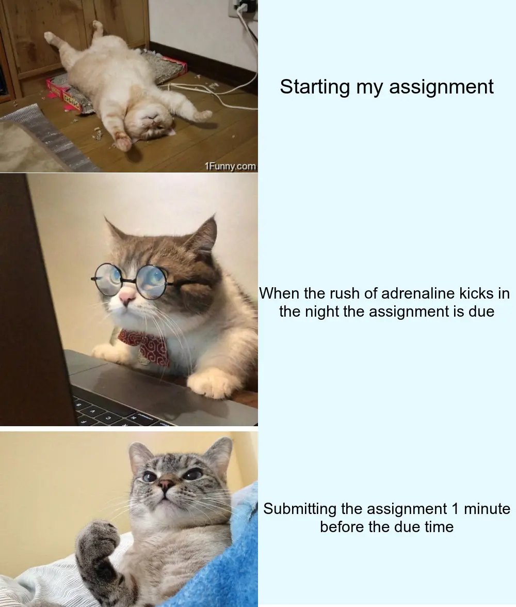

# Pangna Khun STATS220 Assignment 1 

## Overview


<p align = "center">
I was tasked to create a meme using R code for my first assignment. I chose to create a meme about the struggles of completing an assignment as a student.
  </p>

*To do this I joined together 3 segments to create the meme:*

1. Procrastinating to start the assignment
2. Rushing to finish the assignment at the last minute
3. Successfully finishing the assignment 

To help me build this project I used a package in R called [{magick}](https://cran.r-project.org/web/packages/magick/vignettes/intro.html). 

**The following is the checklist of things the code needed to include:**

* Use of pipes 
* use of named objects 
* Use of functions `c()`, `image_blank()`, `image_read()`, `image_annotate()`, `image_append()`, `image_write()` 

## The Code

```r 
library(magick)

starting_cat <- image_read("https://1funny.com/wp-content/uploads/2009/05/tired-cat.jpeg") %>% 
  image_scale(500) 

starting_text <- image_blank(width = 500, height = 335, color = " #e6faff") %>%
  image_annotate(text = "Starting my assignment", size = 40, gravity = "center")

stressed_cat<- image_read("https://i.pinimg.com/564x/16/e6/b6/16e6b6eb6cc6543ed1752290f5b13b71.jpg") %>%
  image_scale(500) 

stressed_text <- image_blank(width = 500, height = 500, color = " #e6faff") %>%
  image_annotate(text = "When the rush of adrenaline kicks in \nthe night the assignment is due", size = 30, gravity = "center")

finished_cat <- image_read("https://external-preview.redd.it/S_v2Ru1PY-LUR_lqJ-OF64vuei6hneXF0bfob9K9AYQ.jpg?auto=webp&s=72fc78ca6d2643674b654e9d158ae30c3a131158") %>%
  image_scale(500) 

finished_text <- image_blank(width = 500, height = 335, color = " #e6faff") %>%
  image_annotate(text = "Submitting the assignment 1 minute\nbefore the due time", size = 30, gravity = "center")


top_vector <- c(starting_cat, starting_text)
top_image <- image_append(top_vector)

middle_vector <- c(stressed_cat, stressed_text)
middle_image <- image_append(middle_vector)

bottom_vector <- c(finished_cat, finished_text)
bottom_image <- image_append(bottom_vector)

assignment_meme <- c(top_image, middle_image, bottom_image) %>%
  image_append(stack= TRUE) 

image_write(assignment_meme, "assignment_meme.png")
```

## The Meme Created


